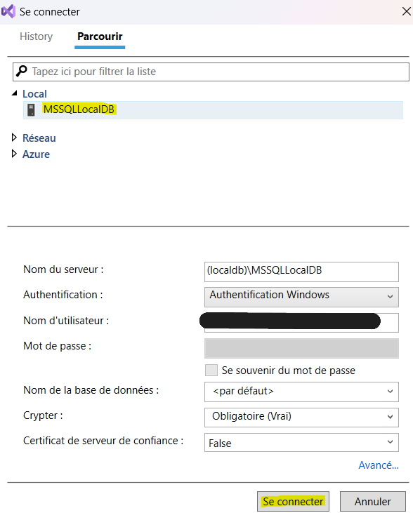
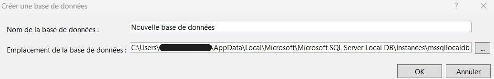
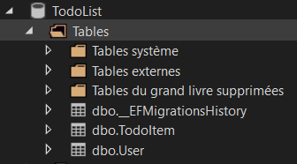
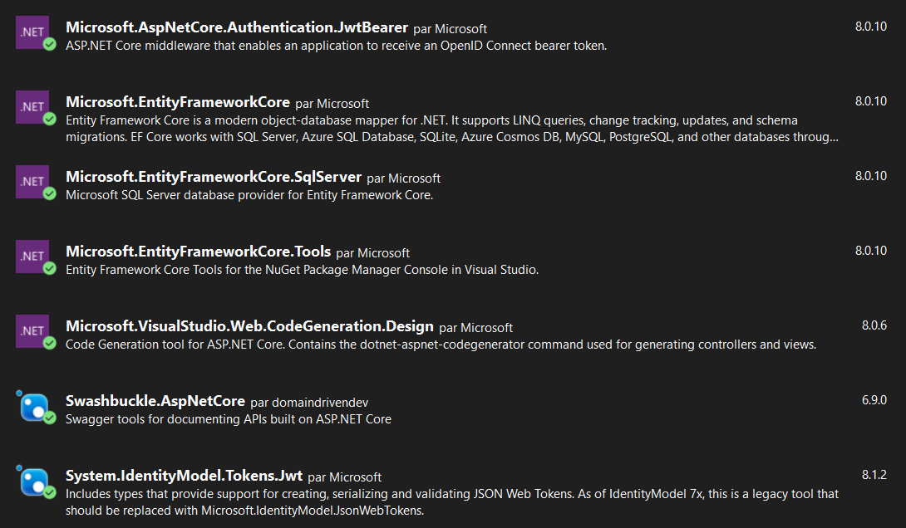

# TodoList_API
API pour TodoList (ASP.NET Core)

## Project Setup
Initialisation de la base de données (BDD Locale) 

- Ouvrir le projet dans visual studio
- Dans l'explorateur d'objet SQL Server, se connecter à l'instance locale MSSQLLocalDB

- Ajouter une nouvelle base de données avec le nom de de votre choix 

- Copier la chaine de connexion dans le fichier appsettings.json
```
...
  "ConnectionStrings": {
    "SqlServer": "[CHAINE_DE_CONNEXION]"
  },
...
```
La chaîne de connexion se trouve dans les propriétés de la base de données (Clique droit -> propriétés -> Chaîne de connexion)
- Ouvrir le PowerShell développeur
- Installer dotnet-ef tool (si ce n'est pas déjà fait) :
`dotnet tool install dotnet-ef --global`
- Executer les migrations :
`dotnet ef database update`

- Vérifier que les tables suivantes ont bien été ajoutées :
- 


Lancer le projet et la fenêtre avec l'url suivante s'ouvre : https://localhost:7075/swagger/index.html

Vous pouvez tester les différents endpoints avec la documention API Swagger.


## Package Nuggets
Voici la liste des packages nuggets utilisés pour le projet : 

